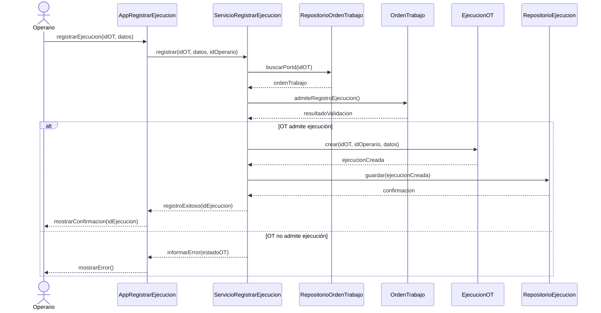
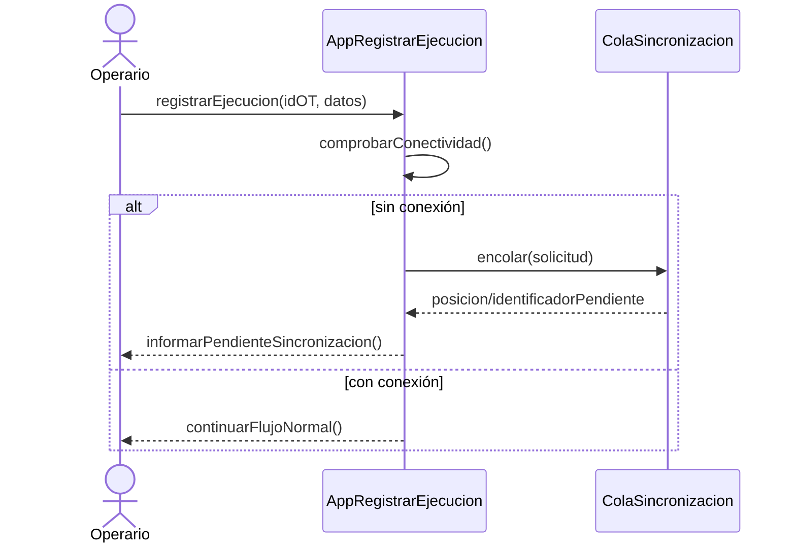
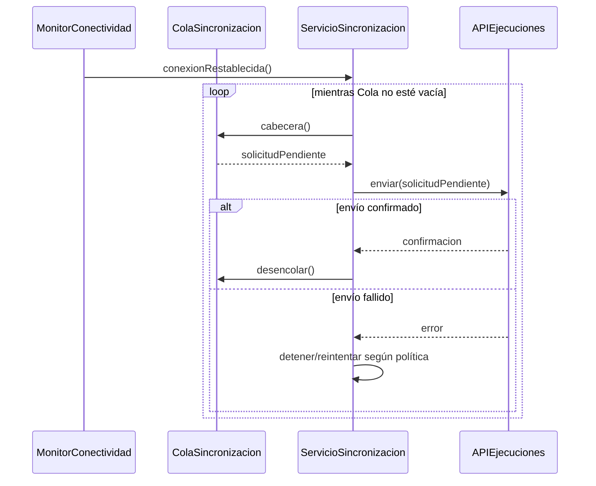
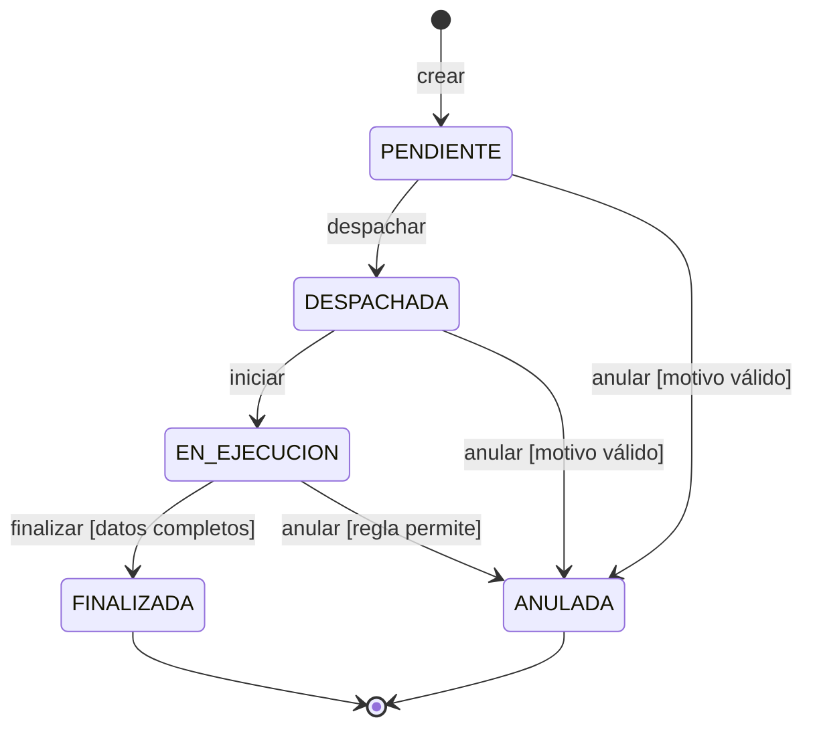

# Producto Día 9 — Diagrama de secuencia
## Registrar ejecución de Orden de Trabajo

**Fecha:** 14/08/2026  
**Materia:** Análisis y Diseño de Software  
**Artefacto:** realización de caso de uso–diseño

---

# 1. Objetivo

Representar el orden temporal de los mensajes necesarios para registrar la ejecución de una OT desde una aplicación móvil.

El diagrama parte de la realización de análisis del Día 8 y agrega decisiones de diseño explícitas.

---

# 2. Caso de uso

```text
Nombre:
Registrar ejecución de OT

Actor:
Operario

Resultado de valor:
La ejecución queda registrada o, si no hay conexión,
queda identificada como pendiente de sincronización.
```

---

# 3. Supuestos de diseño

1. La OT ya existe.
2. El Operario está autenticado y autorizado.
3. `AppRegistrarEjecucion` representa la frontera móvil.
4. `ServicioRegistrarEjecucion` coordina el caso.
5. `RepositorioOrdenTrabajo` obtiene la OT.
6. `RepositorioEjecucion` registra la ejecución.
7. `ColaSincronizacion` conserva solicitudes pendientes por orden de llegada.
8. La Cola es una decisión de diseño/implementación para satisfacer FIFO, no un elemento obligatorio del modelo de análisis.
9. Los nombres de operaciones son didácticos y pueden cambiar en la implementación final.

---

# 4. Participantes

| Participante | Tipo de diseño | Responsabilidad |
|---|---|---|
| `Operario` | Actor | Inicia el caso y recibe resultado |
| `AppRegistrarEjecucion` | Interfaz móvil | Captura datos y presenta mensajes |
| `ServicioRegistrarEjecucion` | Servicio/control de diseño | Coordina el flujo |
| `RepositorioOrdenTrabajo` | Acceso a datos | Recupera la OT |
| `OrdenTrabajo` | Entidad/dominio | Conoce estado y reglas propias |
| `EjecucionOT` | Entidad/dominio | Representa el resultado del trabajo |
| `RepositorioEjecucion` | Acceso a datos | Guarda la ejecución |
| `ColaSincronizacion` | Componente de diseño | Conserva solicitudes pendientes FIFO |

---

# 5. Diagrama de secuencia — flujo normal



---

# 6. Flujo normal — tabla textual

| Orden | Emisor | Receptor | Mensaje/operación | Resultado |
|---:|---|---|---|---|
| 1 | Operario | App | `registrarEjecucion(idOT, datos)` | Inicia el caso |
| 2 | App | Servicio | `registrar(...)` | Delega coordinación |
| 3 | Servicio | Repositorio OT | `buscarPorId(idOT)` | Solicita la OT |
| 4 | Repositorio OT | Servicio | `ordenTrabajo` | Devuelve la entidad |
| 5 | Servicio | OrdenTrabajo | `admiteRegistroEjecucion()` | Consulta regla de dominio |
| 6 | OrdenTrabajo | Servicio | `resultadoValidacion` | Informa si continúa |
| 7 | Servicio | EjecucionOT | `crear(...)` | Construye la ejecución |
| 8 | EjecucionOT | Servicio | `ejecucionCreada` | Devuelve objeto válido |
| 9 | Servicio | Repositorio Ejecución | `guardar(ejecucion)` | Solicita persistencia |
| 10 | Repositorio Ejecución | Servicio | `confirmacion` | Confirma registro |
| 11 | Servicio | App | `registroExitoso(id)` | Devuelve resultado |
| 12 | App | Operario | `mostrarConfirmacion(id)` | Presenta valor al actor |

---

# 7. Alternativo por falta de conexión



## Secuencia del alternativo

```text
A1. Operario solicita registrar la ejecución.
A2. App detecta ausencia de conexión.
A3. App crea una solicitud pendiente con identificador.
A4. App la encola al final de ColaSincronizacion.
A5. Cola confirma su incorporación.
A6. App informa al Operario que la ejecución quedó pendiente.
A7. Al volver la conexión, la primera solicitud pendiente es la primera enviada.
```

La operación sigue siendo:

```text
Registrar ejecución de OT
```

No se transforma en:

```text
Crear una nueva OT
```

---

# 8. Recuperación de conexión



## Regla importante

```text
FIFO
→ preserva orden de procesamiento.

Trazabilidad
→ requiere además identificador, fecha, estado,
  intentos y resultado de cada solicitud.
```

---

# 9. Líneas de vida y focos de control

En una herramienta UML:

- cada participante tendrá una línea de vida vertical;
- los mensajes se ubicarán de arriba hacia abajo;
- `ServicioRegistrarEjecucion` tendrá foco de control durante la coordinación;
- la creación de `EjecucionOT` puede marcarse mediante `create`;
- los retornos pueden representarse con líneas discontinuas.

---

# 10. Decisiones que pertenecen al diseño

```text
RepositorioOrdenTrabajo
RepositorioEjecucion
ServicioRegistrarEjecucion
ColaSincronizacion
protocolo de reintentos
persistencia local
```

No estaban obligatoriamente definidos por el caso de uso. Aparecen al considerar:

- falta de conectividad;
- persistencia;
- separación de responsabilidades;
- orden FIFO;
- trazabilidad;
- tecnología móvil/servidor.

---

# 11. Trazabilidad análisis → diseño

| Análisis | Diseño didáctico |
|---|---|
| `AppRegistrarEjecucion <<interfaz>>` | `AppRegistrarEjecucion` móvil |
| `ControlRegistrarEjecucion <<control>>` | `ServicioRegistrarEjecucion` |
| `OrdenTrabajo <<entidad>>` | `OrdenTrabajo` + `RepositorioOrdenTrabajo` |
| `EjecucionOT <<entidad>>` | `EjecucionOT` + `RepositorioEjecucion` |
| Alternativo sin conexión | `ColaSincronizacion` + monitor/reintentos |

Una clase de análisis puede corresponder a una o varias clases/subsistemas de diseño.

---

# 12. Diagrama de estados complementario — OrdenTrabajo



## Conceptos aplicados

```text
Estados:
PENDIENTE, DESPACHADA, EN_EJECUCION, FINALIZADA, ANULADA.

Eventos:
crear, despachar, iniciar, finalizar, anular.

Condiciones:
datos completos, motivo válido, regla permite.

Transiciones:
relaciones entre estados activadas por eventos.
```

---

# 13. Comprobación de consistencia

- [ ] `despachar()` existe en la clase o servicio correspondiente.
- [ ] `iniciar()` existe.
- [ ] `finalizar()` existe.
- [ ] `anular(motivo)` existe.
- [ ] Existe un caso de uso que invoque cada operación.
- [ ] No existe transición sin regla de negocio justificable.
- [ ] El flujo alternativo no cambia el objetivo del caso.
- [ ] Las decisiones tecnológicas están declaradas como supuestos.

---

# 14. Preguntas de defensa

1. ¿Por qué este diagrama pertenece al diseño y no solamente al análisis?
2. ¿Qué representa el eje vertical?
3. ¿Qué diferencia existe entre línea de vida y foco de control?
4. ¿Por qué `OrdenTrabajo` valida su propio estado?
5. ¿Por qué el Servicio coordina pero no debería concentrar todas las reglas?
6. ¿Qué decisión satisface el RNF de operación sin conexión?
7. ¿Qué diferencia hay entre orden FIFO y trazabilidad?
8. ¿Qué ocurre si el envío del primer pendiente falla?
9. ¿Qué elementos del análisis se dividieron en varias clases de diseño?
10. ¿Cómo se relaciona el diagrama de estados con los casos de uso?
