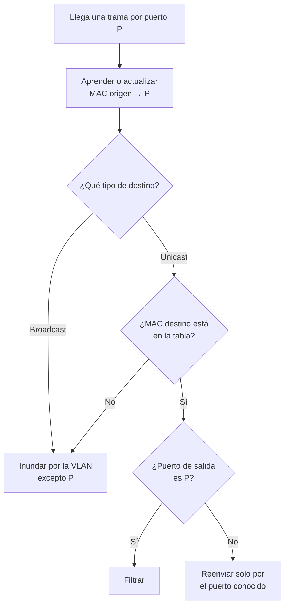
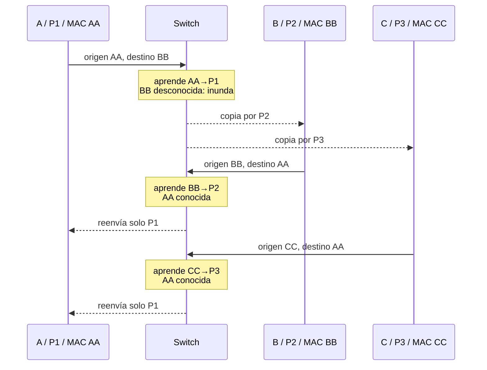
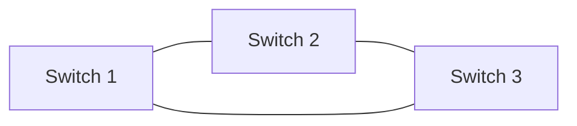
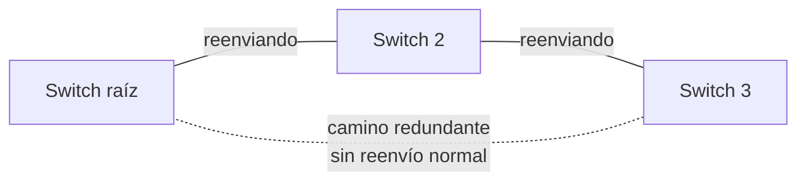
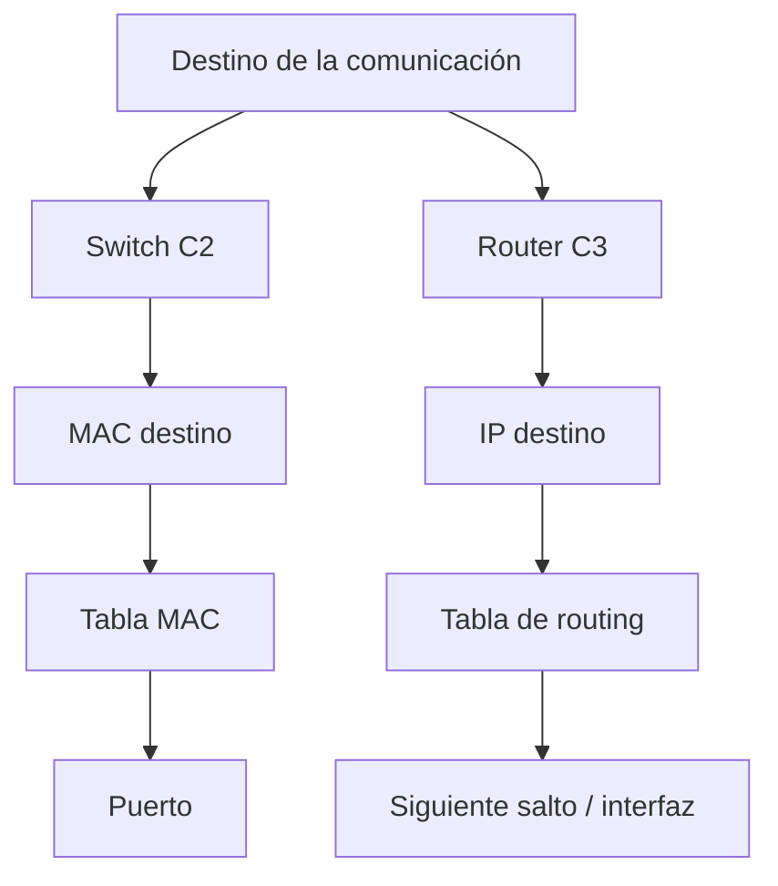

# Mapa — Flujo de un switch, tabla MAC y STP

**Fecha:** 19/08/2026

---

# 1. Decisión por trama



Orden que debe recordarse:

```text
primero aprender origen
después consultar destino
```

---

# 2. Simulación de tabla



Tabla final:

| MAC | Puerto |
|---|---|
| AA | P1 |
| BB | P2 |
| CC | P3 |

---

# 3. Problema del ciclo



Los tres enlaces forman redundancia física y también un ciclo. Una trama inundada puede volver al punto de origen y generar copias sucesivas.

---

# 4. Resultado lógico de STP



Interpretación:

- el cable redundante continúa existiendo;
- la topología lógica activa no contiene un ciclo;
- ante un cambio, STP puede recalcular y habilitar el camino alternativo;
- la convergencia requiere tiempo y depende de la variante/configuración.

---

# 5. Comparación de decisiones



---

# 6. Consigna oral

Explicar el mapa completo sin usar las palabras “manda a todos” como única respuesta. Deben aparecer:

```text
origen
destino
aprendizaje
tabla
destino conocido/desconocido
inundación limitada
redundancia
bucle
STP
```
