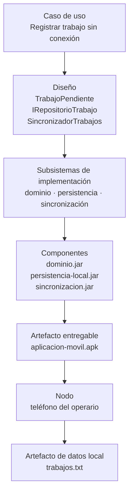
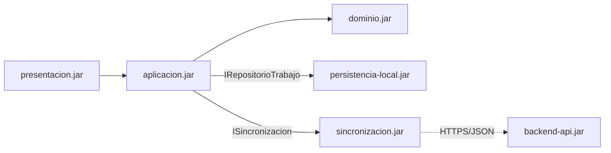
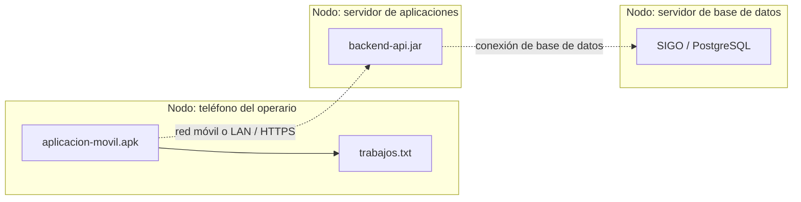
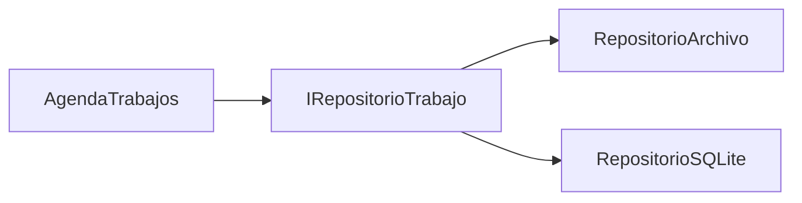

# Mapa — UML, código, componentes y nodos

**Fecha:** 19/08/2026
**Caso:** SIGO — trabajos pendientes sin conexión

---

# 1. Trazabilidad vertical

Lectura:

1. el caso de uso exige una conducta;
2. el diseño asigna responsabilidades;
3. la implementación agrupa clases e interfaces;
4. los componentes forman un artefacto entregable;
5. el artefacto se instala en un nodo;
6. la ejecución produce o consume un archivo local.

---

# 2. Vista de componentes

Qué se observa:

- piezas de software;
- interfaces ofrecidas o requeridas;
- dependencias;
- límites de subsistemas.

Qué no se observa todavía:

- el teléfono concreto;
- el servidor físico o virtual;
- la conexión de red como topología física.

---

# 3. Vista de despliegue

Qué se observa:

- nodos de ejecución;
- artefactos alojados;
- conexiones relevantes;
- distribución de responsabilidades físicas.

---

# 4. Tabla de correspondencia

| Elemento | Tipo | Vista principal | Observación |
|---|---|---|---|
| `TrabajoPendiente` | clase | diseño | concepto del dominio |
| `IRepositorioTrabajo` | interfaz | diseño/implementación | contrato estable |
| `RepositorioArchivo` | clase de implementación | diseño/implementación | realiza la interfaz |
| `persistencia-local.jar` | componente/artefacto | implementación | empaqueta código |
| `aplicacion-movil.apk` | artefacto ejecutable | implementación y despliegue | pieza física alojada |
| teléfono | nodo | despliegue | recurso de ejecución |
| servidor de aplicaciones | nodo | despliegue | aloja el backend |
| `trabajos.txt` | artefacto de datos | implementación/despliegue | persiste estado local |
| LAN/red móvil | conexión | despliegue | comunica nodos |

Un mismo artefacto puede aparecer en un diagrama de componentes y en uno de despliegue, pero responde preguntas distintas.

---

# 5. Cambio controlado

Si `RepositorioArchivo` se reemplaza por `RepositorioSQLite` y ambos realizan `IRepositorioTrabajo`:

- cambia el componente de persistencia;
- puede cambiar el artefacto de datos local;
- `AgendaTrabajos` no debería cambiar si depende del contrato;
- el teléfono sigue siendo el nodo mientras la ubicación de ejecución no cambie;
- se aprovechan DIP, OCP y bajo acoplamiento.

---

# 6. Consigna de práctica

Dibujar una variante con:

- servidor propio;
- servidor contratado;
- un componente de sincronización independiente;
- una base de datos central;
- el protocolo entre cada par de nodos.

Luego marcar qué elemento cambia en cada decisión y qué RNF la motiva.
