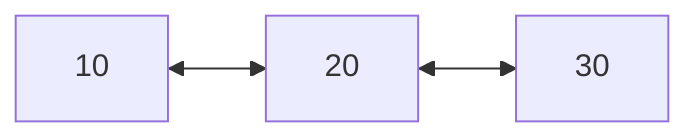
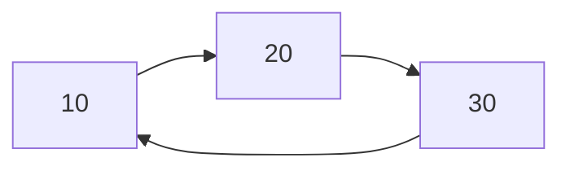

# Ficha — Listas avanzadas e iteradores

**Día:** 11 — 18/08/2026

---

# 1. Comparación

| Variante | Enlaces por nodo | Condición de fin | Ventaja | Riesgo |
|---|---:|---|---|---|
| simple | siguiente | `actual == null` | menor memoria | no retrocede |
| doble | anterior y siguiente | `actual == null` | recorre ambos sentidos | más enlaces que mantener |
| circular | siguiente; último vuelve al primero | regresar al inicio | ciclos/turnos | bucle infinito |
| ordenada | según implementación | según estructura base | conserva orden al insertar | búsqueda de posición |

---

# 2. Lista doble



Para insertar `X` entre `A` y `B`:

```java
X.anterior = A;
X.siguiente = B;
A.siguiente = X;
B.anterior = X;
```

Las cuatro referencias deben quedar coherentes.

---

# 3. Lista circular



Recorrido de una vuelta:

```java
Nodo inicio = actual;
do {
    procesar(actual);
    actual = actual.siguiente;
} while (actual != inicio);
```

Una lista circular no vacía no termina en `null`.

---

# 4. Lista ordenada

Al insertar, se busca el primer nodo cuya clave sea mayor o igual que la nueva. La lista queda ordenada después de cada operación.

```text
insertar 30 → 30
insertar 10 → 10, 30
insertar 20 → 10, 20, 30
```

Una lista ordenada es una política de organización; puede implementarse como simple o doble.

---

# 5. Iterador

El iterador abstrae el recorrido independientemente de la representación.

```java
Iterator<Trabajo> it = trabajos.iterator();
while (it.hasNext()) {
    Trabajo actual = it.next();
}
```

```text
hasNext() → indica si queda un elemento
next()    → devuelve el siguiente y avanza
remove()  → elimina de forma controlada el último devuelto
```

---

# 6. Selección

- navegación atrás/adelante → doble;
- turnos que se repiten → circular;
- prioridades siempre ordenadas → ordenada;
- solo insertar/recorrer con bajo costo estructural → simple;
- colección estándar redimensionable → `ArrayList`.

Elegir por operaciones dominantes, no por costumbre.

---

# 7. Preguntas de control

1. ¿Qué agrega un nodo doble?
2. ¿Qué cuatro enlaces cambian al insertar en el centro?
3. ¿Cómo termina el recorrido circular?
4. ¿Por qué una circular puede quedar en bucle infinito?
5. ¿Cuándo se decide la posición en una ordenada?
6. ¿Qué oculta un iterador?
7. ¿Qué permanece igual entre las implementaciones de un mismo TDA?
